# 🏖️ Sandbox

 

This program is a sandbox 2D application simulating the interactions between a large number of materials. It uses a grid where each square represents an element of a material.

 

⚠️ This repository contains **submodules**, add `--recurse-submodules` when cloning ⚠️

 

	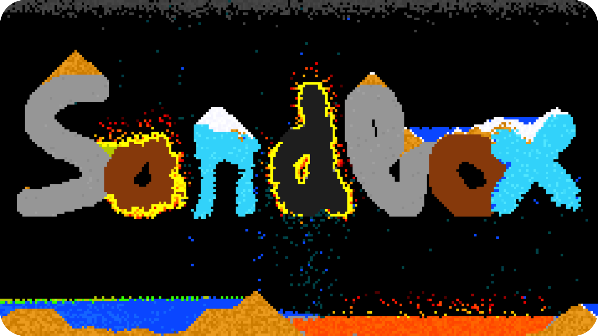

 

# 📋 Summary

* **[📋 Summary](#-summary)**
* **[✨ Features](#-features)**
* **[🛠️ Install](#%EF%B8%8F-install)**
	* [🦴 Skeleton project install](#-skeleton-project-install)
* **[🗓️ Releases](#%EF%B8%8F-releases)**
* **[🧪 Tests](#-tests)**
* **[🙏 Credits](#-credits)**

 

# ✨ Features

### Menu

* A menu to control the simulation

* You can choose the resolution of the grid

* You can choose the type and the size of the brush

* You can put any material in the grid

### Materials

* **Stone:**

	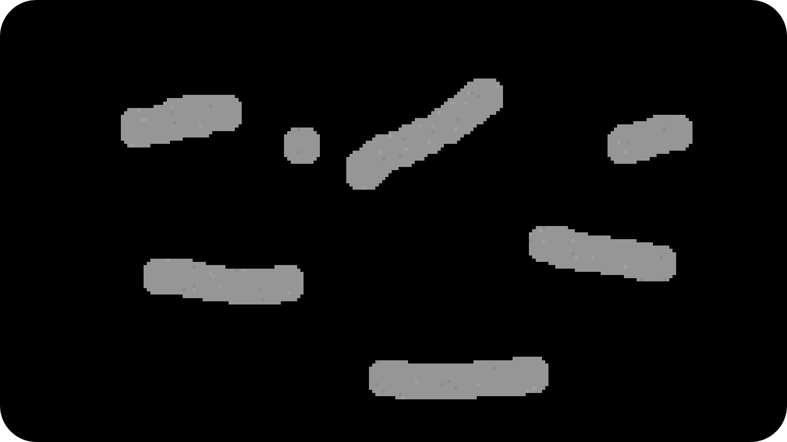

* **Sand:** it flows just like in real life

	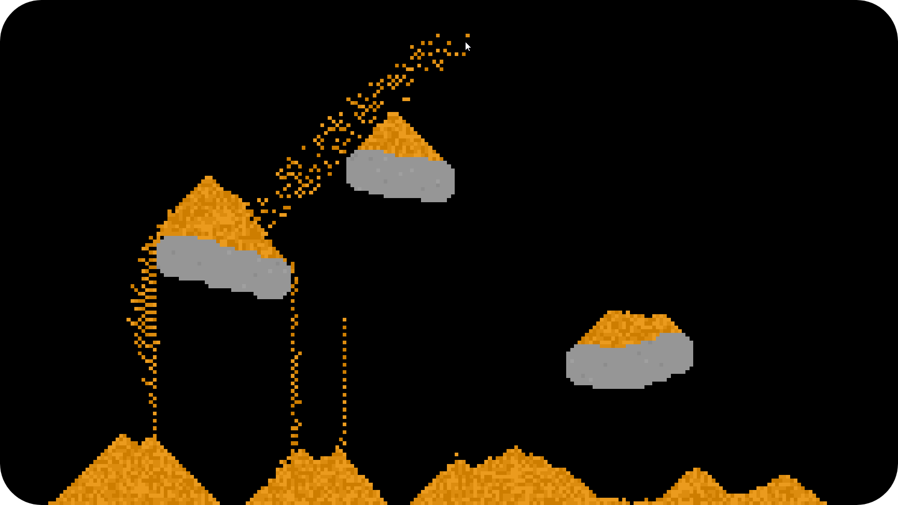

* **Water:** it flows just like in real life and evaporates with fire

	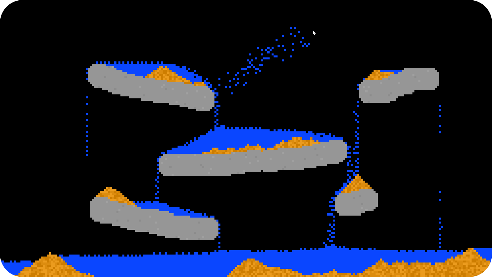

* **Salt:** it dissolves with water

	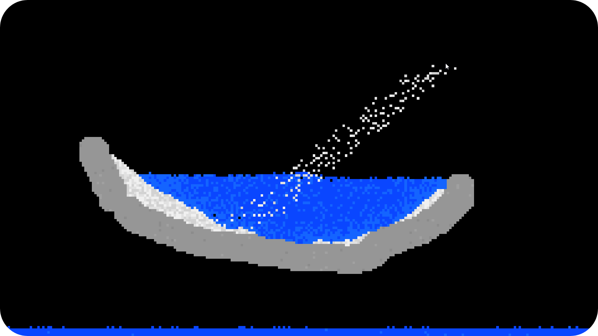

* **Wood:** it burns with fire and create ash

	

* **Coal:** like wood but it is harder to burn

	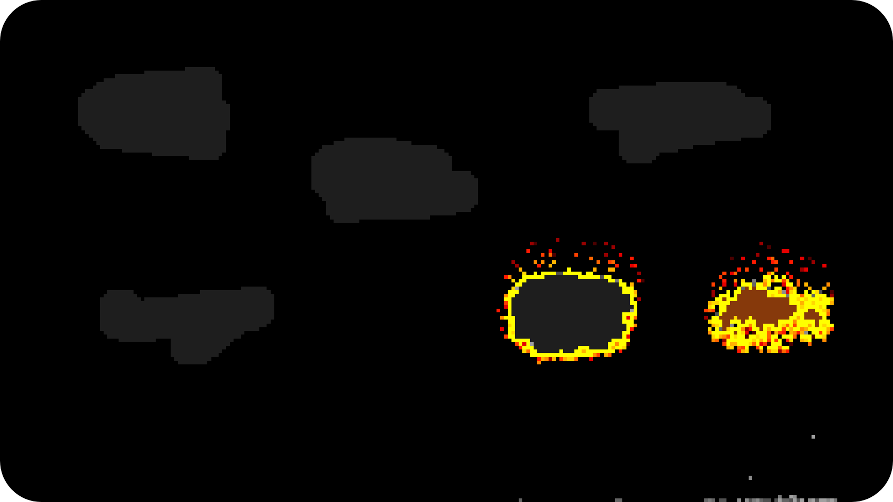

* **Oil:** a liquid that can burn

	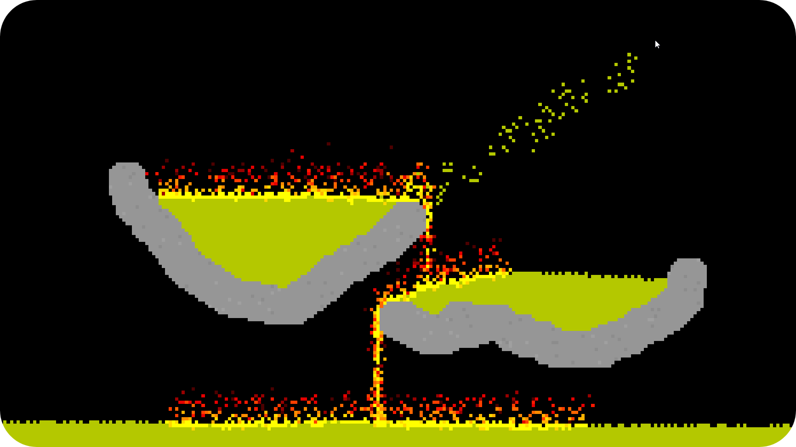

* **Gas:** it behaves like gas in real life and can burn

	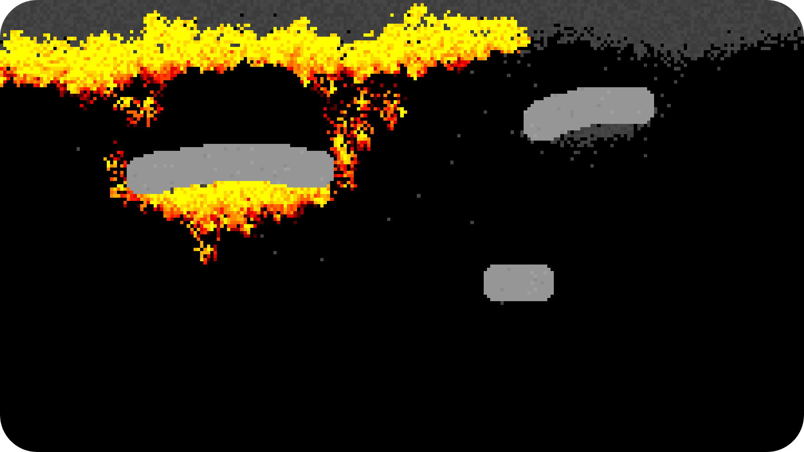

* **Lava:** a liquid that burns everything and becomes stone with time or water

	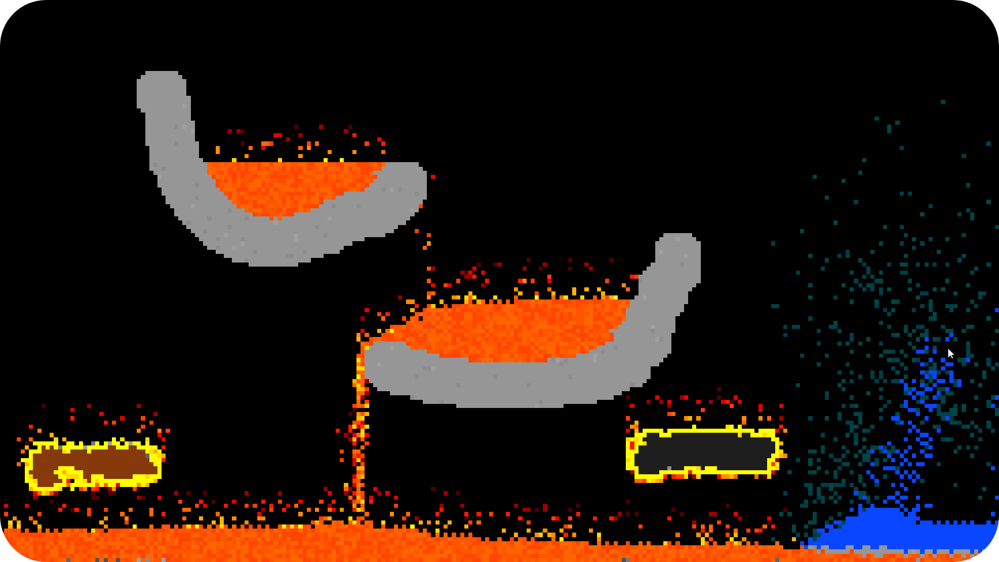

* **Ice:** it can melt with time or fire

	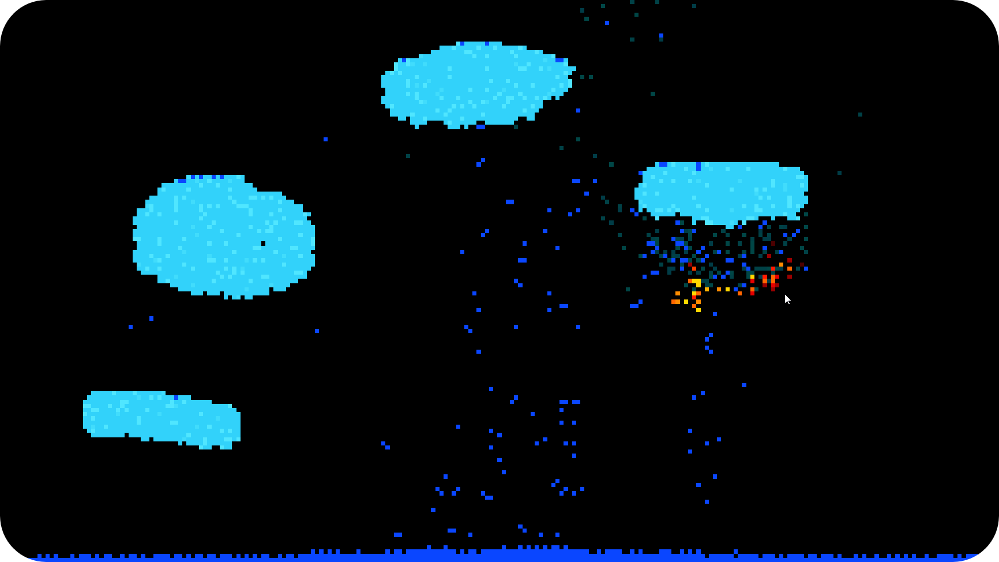

* **Snow:** it can melt with time, fire or salt

	

* **Acid:** it dissolves everything

	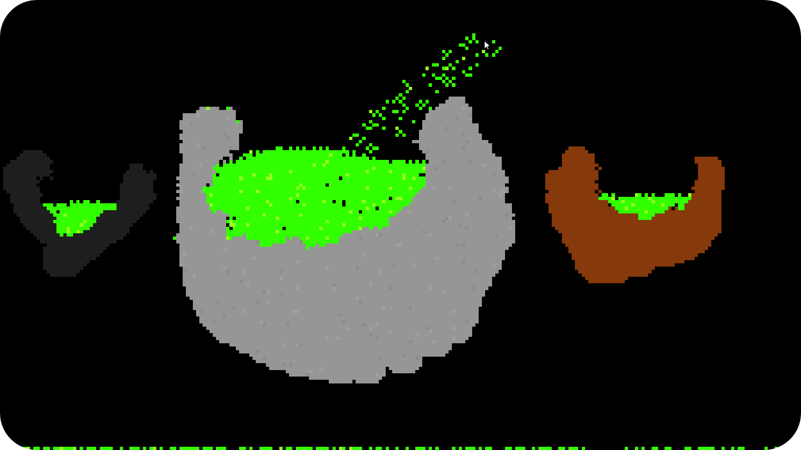

 

# 🛠️ Install

## 🦴 Skeleton project install

This repository is based on my [**Graphics skeleton project**](https://github.com/angeluriot/Graphics_skeleton), so go see its [**install**](https://github.com/angeluriot/Graphics_skeleton#install) part.

 

# 🗓️ Releases

If you just want to test the program without editing the source code, go see the [**Releases**](https://github.com/angeluriot/Sandbox/releases).

 

# 🧪 Tests

	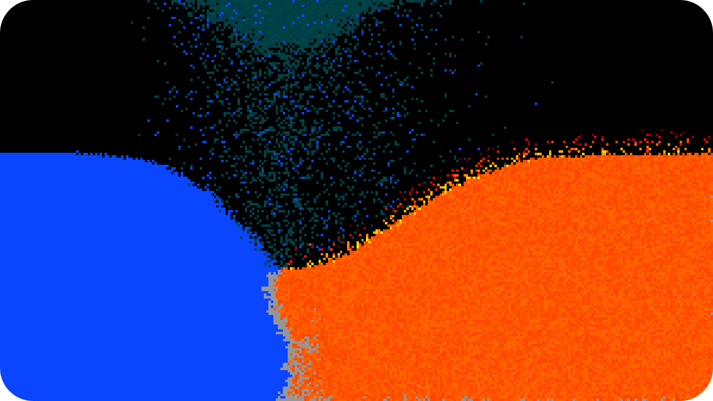

	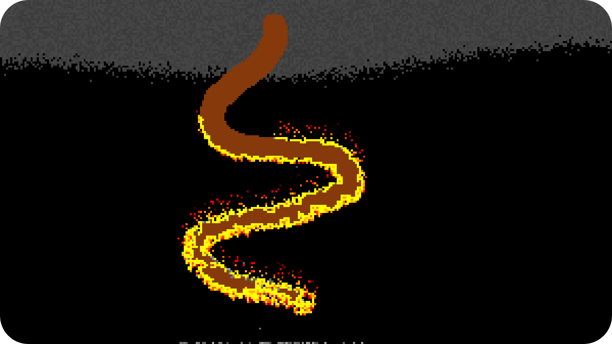

	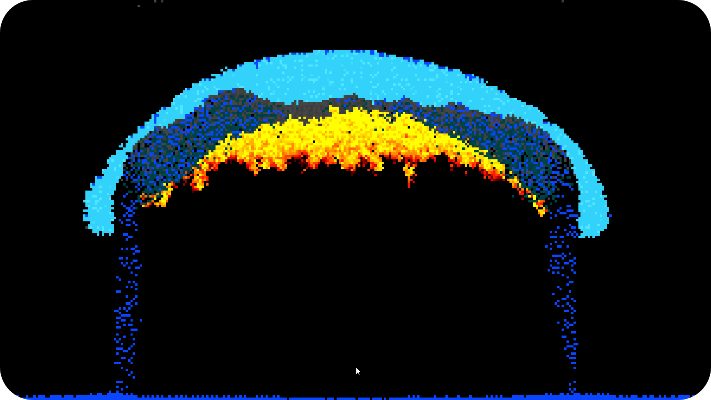

 

# 🙏 Credits

* [**Angel Uriot**](https://github.com/angeluriot) : Creator of the project.
